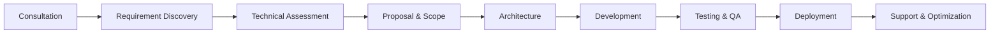

<div align="center">


<br/>

[](https://dexelglobalholdings.web.app/)
[](https://demiyandissanayakeofficial.web.app/)

[](https://github.com/Dexel-Software-Solutions?tab=followers)
[](https://hits.sh/github.com/Dexel-Software-Solutions/)
[](https://github.com/Dexel-Software-Solutions?tab=repositories)
[](mailto:dexelsoftwaresolutions@gmail.com)
[](https://wa.me/94729504289)

<br/>

**[Overview](#-company-overview) · [Websites](#-official-websites) · [Services](#-core-services) · [Stack](#-technology-stack) · [Projects](#-flagship-projects) · [Leadership](#-leadership) · [Why Dexel](#-why-dexel) · [Contact](#-contact--business-information)**

</div>

---

## 🏢 Company Overview

**Dexel Software Solutions** is an independent software engineering company based in Sri Lanka, delivering **secure, scalable and intelligent digital systems** for businesses and organizations worldwide.

We follow **industry-standard engineering practices**, **security-first development**, and **clean, maintainable architectures** built for long-term success.

<div align="center">

| 🎯 Vision | 🧭 Mission |
|:---|:---|
| To build intelligent, secure and scalable digital systems that solve meaningful business and technology problems, while maintaining strong engineering standards. | To create thoughtful software that combines quality engineering, security awareness, innovation and maintainability, with measurable business value for every client. |

</div>

<div align="center">

| 17+ | 8 | 10 | 100% |
|:---:|:---:|:---:|:---:|
| Software Repositories | Service Areas | Programming Languages | Secure-by-Design Standard |

</div>

---

## 🌐 Official Websites

<div align="center">

<table>
<tr>
<td align="center" width="50%">

### 🏛️ Dexel Corporate Profile
*Capabilities, services, methodology & project showcase*

[](https://dexelglobalholdings.web.app/)

`dexelglobalholdings.web.app`

</td>
<td align="center" width="50%">

### 👤 Demiyan Dissanayake — Founder & CEO
*Executive portfolio, certifications, projects, CV & achievements*

[](https://demiyandissanayakeofficial.web.app/)

`demiyandissanayakeofficial.web.app`

</td>
</tr>
</table>

</div>

---

## 🛠️ Core Services

<div align="center">

| 🖥️ Enterprise Software | 🌐 Web & Mobile Apps | 🤖 AI & Automation |
|:---:|:---:|:---:|
| Custom enterprise-grade systems | Full-stack web & React Native mobile engineering | AI-assisted systems & workflow automation |

| 🔐 Cyber Security | 🖱️ Desktop Applications | ⚙️ Business Solutions |
|:---:|:---:|:---:|
| Defensive research, threat analysis & authorized testing tools | Cross-platform desktop apps (Python, Java) | CRM, inventory, school & hospital management systems |

| ☁️ Cloud & Infrastructure | 💡 Technical Consulting | 🧩 Custom Digital Solutions |
|:---:|:---:|:---:|
| Docker, AWS, Linux & deployment foundations | Architecture, system design & delivery planning | Tailored solutions for unique operational challenges |

</div>

---

## 🧰 Technology Stack

<div align="center">


<br/><br/>

<br/><br/>


<br/>


</div>

<details>
<summary><b>📈 Proficiency Overview (click to expand)</b></summary>
<br/>

<div align="center">

| Language | Level | Used In |
|---|:---:|---|
| Python |  | MIRAGE, PHANTOMNET, Phantom Framework, Tkinter GUIs |
| JavaScript |  | NexusJS, React apps, Node.js backends |
| HTML5 / CSS3 |  | NovaCSS, responsive UI engineering |
| TypeScript |  | VEXA, React Native components |
| Go |  | GHOSTWRITER |
| Bash |  | CyberForge |
| SQL |  | MySQL / PostgreSQL design |
| Java |  | PortSentinel, Swing apps |
| PHP |  | Dynamic web backends |
| Rust |  | Memory-safe tooling |

</div>

</details>

---

## 🚀 Flagship Projects

<div align="center">

| Project | Description | Stack | Domain |
|---|---|:---:|---|
| [**MIRAGE**](https://github.com/Dexel-Software-Solutions/MIRAGE) | Deception-first security framework with honeypots & attacker traps | Python | 🛡️ Cyber Defense |
| [**PHANTOMNET**](https://github.com/Dexel-Software-Solutions/PHANTOMNET) | AI-driven moving-target defense that morphs a personalized fake network per attacker | Python | 🌀 Moving Target Defense |
| [**Phantom Framework**](https://github.com/Dexel-Software-Solutions/Phantom-Framework) | Modular pentesting framework: OSINT, DNS recon, CVE intel, automated reporting | Python | 👻 Authorized Testing |
| [**GHOSTWRITER**](https://github.com/Dexel-Software-Solutions/GHOSTWRITER) | Behavioral threat intelligence engine tracking attackers across IP rotation | Go | 🧠 Threat Intelligence |
| [**VEXA**](https://github.com/Dexel-Software-Solutions/VEXA-Realtime-Chat-App) | Real-time cross-platform mobile chat with WebSockets & MySQL | TypeScript | 📱 Mobile / Full-Stack |
| [**AI Meeting Assistant**](https://github.com/Dexel-Software-Solutions/AI-MEETING-ASSISTANT) | AI-powered smart desktop meeting overlay & note-taking | Python | 🤖 AI Systems |

</div>

### 📌 Pinned Repositories

<div align="center">

[](https://github.com/Dexel-Software-Solutions/MIRAGE)
[](https://github.com/Dexel-Software-Solutions/PHANTOMNET)
[](https://github.com/Dexel-Software-Solutions/GHOSTWRITER)
[](https://github.com/Dexel-Software-Solutions/NexusJS-Framework)

</div>

<details>
<summary><b>📚 Full Project Portfolio (click to expand)</b></summary>
<br/>

<div align="center">

| Project | Overview | Tech | Category |
|---|---|:---:|---|
| [**MIRAGE**](https://github.com/Dexel-Software-Solutions/MIRAGE) | Deception-based cyber defense framework | Python | 🛡️ Security |
| [**PHANTOMNET**](https://github.com/Dexel-Software-Solutions/PHANTOMNET) | Autonomous deceptive network topology morphing | Python | 🌀 Defense Research |
| [**Phantom Framework**](https://github.com/Dexel-Software-Solutions/Phantom-Framework) | Advanced pentesting & recon toolkit | Python | 👻 Offensive Security |
| [**GHOSTWRITER**](https://github.com/Dexel-Software-Solutions/GHOSTWRITER) | Behavioral threat intelligence engine | Go | 🧠 Threat Intelligence |
| [**Auto Bug Finder**](https://github.com/Dexel-Software-Solutions/Auto-bug-finder) | Static vulnerability & code-quality analyzer | Python | 🔴 DevSecOps |
| [**DEXEL IP INTEL**](https://github.com/Dexel-Software-Solutions/DEXEL-IP-INTEL) | IP intelligence & risk scoring | Python | 🌍 Intelligence |
| [**PortSentinel**](https://github.com/Dexel-Software-Solutions/PortSentinel) | Real-time port monitoring & anomaly detection | Java | 🔬 Network Security |
| [**CyberForge**](https://github.com/Dexel-Software-Solutions/CyberForge) | Pure-Bash security toolkit (20+ modules) | Bash | 🔧 Toolkit |
| [**Password Security Auditor**](https://github.com/Dexel-Software-Solutions/Advanced-Password-Security-Auditor) | Password entropy & breach analyzer | Python | 🔐 Security |
| [**Anon Encrypter**](https://github.com/Dexel-Software-Solutions/Anon-Encrypter) | Multi-layer encryption system | Python | 🔒 Cryptography |
| [**Linux Command Center**](https://github.com/Dexel-Software-Solutions/Linux-Command-Center) | GUI Linux command suite (200+ tools) | Python | 🖥️ Utility |
| [**VEXA Realtime Chat**](https://github.com/Dexel-Software-Solutions/VEXA-Realtime-Chat-App) | Real-time mobile chat platform | TypeScript | 📱 Mobile |
| [**AI Meeting Assistant**](https://github.com/Dexel-Software-Solutions/AI-MEETING-ASSISTANT) | AI-powered meeting overlay | Python | 🤖 AI Systems |
| [**NexusJS Framework**](https://github.com/Dexel-Software-Solutions/NexusJS-Framework) | Signal-based, zero-VDOM JS framework | JS | ⚡ Framework |
| [**NovaCSS Framework**](https://github.com/Dexel-Software-Solutions/NovaCSS-Framework) | Utility-first CSS with glassmorphism & dark mode | CSS | 🎨 UI Framework |
| [**PythonMasterApp**](https://github.com/Dexel-Software-Solutions/PythonMasterApp) | Offline Python & cybersecurity learning platform | Python | 🎓 EdTech |
| [**Dexel Clock**](https://github.com/Dexel-Software-Solutions/Dexel-Clock) | Modern desktop clock app | Python | ⏰ Utility |

</div>

</details>

---

## 👨‍💻 Leadership

<div align="center">

**Demiyan Dissanayake** — *Founder & CEO · Software Engineer · Technology Entrepreneur*

Full-stack engineering · Cybersecurity research · Software architecture · Automation · Digital product development

[](https://demiyandissanayakeofficial.web.app/)
[](https://www.linkedin.com/in/demiyan-dissanayake/)
[](https://www.credly.com/users/demiyan-dissanayake)
[](https://demiyandissanayakeofficial.web.app/assests/pdf/cv.pdf)

</div>

<details>
<summary><b>🎓 Certifications — 12 Verified Credly Badges</b></summary>
<br/>

| Certification | Issuer | Issued |
|---|:---:|:---:|
| Junior Cybersecurity Analyst Career Path | Cisco | Jun 2024 |
| Introduction to Cybersecurity | Cisco | Oct 2022 |
| Networking Basics | Cisco | Jun 2024 |
| Introduction to IoT | Cisco | Jun 2024 |
| Computer Hardware Basics | Cisco | Feb 2025 |
| Cybersecurity Awareness Learner 2025 | CertiProf | Feb 2025 |
| Scrum Foundation Learner 2025 | CertiProf | Feb 2025 |
| Design Sprint Learner 2025 | CertiProf | Feb 2025 |
| Business Model Canvas Essentials 2025 | CertiProf | Feb 2025 |
| Digital Marketing Learner 2025 | CertiProf | Feb 2025 |
| Remote Work Learner 2025 | CertiProf | Feb 2025 |
| Lifelong Learning | CertiProf | Feb 2025 |

</details>

<details>
<summary><b>🏅 Leadership & Scouting Achievements</b></summary>
<br/>

| Year | Achievement |
|:---:|---|
| 2025 | **President's Scout Rank** — Sri Lanka Scout Association |
| 2026 | Council Member — **1st National Scout Youth Council** |
| 2026 | Troop Leader & **155th Advanced Scout Leader Course** graduate |
| 2025–26 | Jamnas XII (Jakarta) delegation mentor & national expeditions |

</details>

<details>
<summary><b>✍️ Creative Works</b></summary>
<br/>

📖 **[Eye of the Abyss](https://eyeoftheabyss.netlify.app/)** — a suspense thriller online novella written and published by Demiyan Dissanayake.

</details>

---

## 💎 Why Dexel

<div align="center">

| 🧱 Engineering-first | 🔐 Security-aware | 🎯 Custom-built |
|:---:|:---:|:---:|
| Solutions begin with real technical requirements | Security is part of every stage, not an add-on | Systems adapt to your specific workflows |

| 📈 Scalable Architecture | ⚡ Modern Technology | 💬 Direct Communication |
|:---:|:---:|:---:|
| Foundations built for maintainability & growth | Tools chosen for fit and longevity | Technical goals tied to business outcomes |

</div>

---

## 🔄 How We Work

<div align="center">



</div>

---

## ✅ Quality & Security Standards

<div align="center">

```
╔══════════════════════════════════════════════════════════╗
║            DEXEL QUALITY ASSURANCE STANDARDS             ║
╠══════════════════════════════════════════════════════════╣
║  ✔  Secure-by-Design Development                         ║
║  ✔  Role-Based Access Control (RBAC)                     ║
║  ✔  Data Encryption & Compliance Awareness               ║
║  ✔  Modular & Scalable Architectures                     ║
║  ✔  Performance Optimization                             ║
║  ✔  Clean & Maintainable Codebases                       ║
╚══════════════════════════════════════════════════════════╝
```

</div>

> 🔐 All security tooling is developed for **defensive research, education and authorized testing only**.

---

## 🧭 Roadmap

- [x] Corporate profile website live
- [x] Founder executive portfolio live
- [x] 17+ open-source repositories published
- [ ] Dedicated Dexel product website
- [ ] SaaS product launches
- [ ] Open-source community programs & contributor guides

---

## 📊 GitHub Metrics

<div align="center">


<br/>


</div>

---

## 🤝 Collaboration & Partnerships

<div align="center">

We are open to working with ambitious teams and organizations:


</div>

---

## 📬 Contact & Business Information

<div align="center">

| | |
|:---|:---|
| 📧 **Business Email** | [dexelsoftwaresolutions@gmail.com](mailto:dexelsoftwaresolutions@gmail.com) |
| 💬 **WhatsApp** | [+94 72 950 4289](https://wa.me/94729504289) |
| 🌍 **Corporate Website** | [dexelglobalholdings.web.app](https://dexelglobalholdings.web.app/) |
| 👤 **Founder Portfolio** | [demiyandissanayakeofficial.web.app](https://demiyandissanayakeofficial.web.app/) |
| 🐙 **GitHub** | [Dexel-Software-Solutions](https://github.com/Dexel-Software-Solutions) |
| 💼 **LinkedIn** | [Demiyan Dissanayake](https://www.linkedin.com/in/demiyan-dissanayake/) |
| 📍 **Location** | Dankotuwa, Sri Lanka |

<br/>

[](https://dexelglobalholdings.web.app/#contact)

</div>

---

<div align="center">


<br/>

[](https://hits.sh/github.com/Dexel-Software-Solutions/footer/)

**Dexel Software Solutions**
*Secure • Scalable • Intelligent Software Engineering*

© 2026 Dexel Software Solutions. All rights reserved.

</div>
